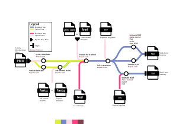

<h1>
  <picture>
    <source media="(prefers-color-scheme: dark)" srcset="docs/images/nf-core-plasmodiumdrugres_logo_dark.png">
    
  </picture>
</h1>

[](https://github.com/codespaces/new/nf-core/plasmodiumdrugres)
[](https://github.com/nf-core/plasmodiumdrugres/actions/workflows/nf-test.yml)
[](https://github.com/nf-core/plasmodiumdrugres/actions/workflows/linting.yml)[](https://nf-co.re/plasmodiumdrugres/results)[](https://doi.org/10.5281/zenodo.XXXXXXX)
[](https://www.nf-test.com)

[](https://www.nextflow.io/)
[](https://github.com/nf-core/tools/releases/tag/4.1.0)
[](https://docs.conda.io/en/latest/)
[](https://www.docker.com/)
[](https://sylabs.io/docs/)
[](https://cloud.seqera.io/launch?pipeline=https://github.com/nf-core/plasmodiumdrugres)

[](https://nfcore.slack.com/channels/plasmodiumdrugres)[](https://bsky.app/profile/nf-co.re)[](https://mstdn.science/@nf_core)[](https://www.youtube.com/c/nf-core)

## Introduction

**nf-core/plasmodiumdrugres** is a bioinformatics pipeline for analyzing drug resistance markers from microhaplotype data. It translates variants into amino acid changes at drug resistance loci and estimates allele frequencies and prevalences at both single-locus and multi-locus levels. Microhaplotype data can be supplied in the form of an allele table or a [PMO](https://plasmogenepi.github.io/PMO_Docs/) file.



1. Translate loci of interest ([`PGEcore`](https://github.com/PlasmoGenEpi/PGEcore))
2. Split by population
3. Estimate allele prevalence ([`PGEcore`](https://github.com/PlasmoGenEpi/PGEcore))
4. Estimate multilocus allele frequency. Choice of method between:
   1. [MultiLociBiallelicModel](https://www.frontiersin.org/articles/10.3389/fepid.2022.943625/full) ([`PGEcore` wrapper script](https://github.com/PlasmoGenEpi/PGEcore))
   2. [FreqEstimationModel](https://doi.org/10.1186/1475-2875-13-102) ([`PGEcore` wrapper script](https://github.com/PlasmoGenEpi/PGEcore))
   3. Naive method ([`PGEcore`](https://github.com/PlasmoGenEpi/PGEcore))
5. Estimate single locus allele frequency. Choice of method between:
   1. [Incomplete data model (IDM)](https://doi.org/10.1371/journal.pone.0287161) ([`PGEcore` wrapper script](https://github.com/PlasmoGenEpi/PGEcore))
   2. [Naive `PGEcore` method](https://github.com/PlasmoGenEpi/PGEcore)
   3. [mhaps_freq (from microhaplotype frequencies via DCIFER)](https://github.com/PlasmoGenEpi/PGEcore)
6. Merge prevalence and frequency outputs
7. Concatenate population outputs into standardized summary tables, while preserving full tool-specific columns in `raw_summaries/`

## Usage

> [!NOTE]
> If you are new to Nextflow and nf-core, please refer to [this page](https://nf-co.re/docs/get_started/environment_setup/overview) on how to set-up Nextflow. Make sure to [test your setup](https://nf-co.re/docs/get_started/run-your-first-pipeline) with `-profile test` before running the workflow on actual data.

The pipeline accepts either a [Portable Microhaplotype Object (PMO)](https://plasmogenepi.github.io/PMO_Docs/) or an allele table plus panel BED. You must also provide a [loci of interest BED](https://nf-co.re/plasmodiumdrugres/usage#loci-of-interest-input). Optionally provide [loci groups](https://nf-co.re/plasmodiumdrugres/usage#loci-groups) for multi-locus estimates and a population assignment for multi-population runs.

Now, you can run the pipeline using a PMO:

```bash
nextflow run nf-core/plasmodiumdrugres \
   -profile <docker/singularity/.../institute> \
   --pmo input_file.pmo \
   --loci_of_interest_bed loci_of_interest.bed \
   --loci_groups loci_groups.tsv \
   --outdir <OUTDIR>
```

Or with an allele table:

```bash
nextflow run nf-core/plasmodiumdrugres \
   -profile <docker/singularity/.../institute> \
   --allele_table allele_table.tsv \
   --panel_info_bed panel_info.bed \
   --loci_of_interest_bed loci_of_interest.bed \
   --loci_groups loci_groups.tsv \
   --outdir <OUTDIR>
```

> [!WARNING]
> Please provide pipeline parameters via the CLI or Nextflow `-params-file` option. Custom config files including those provided by the `-c` Nextflow option can be used to provide any configuration _**except for parameters**_; see [docs](https://nf-co.re/docs/running/run-pipelines#using-parameter-files).

For more details and further functionality, please refer to the [usage documentation](https://nf-co.re/plasmodiumdrugres/usage) and the [parameter documentation](https://nf-co.re/plasmodiumdrugres/parameters).

## Pipeline output

To see the results of an example test run with a full size dataset refer to the [results](https://nf-co.re/plasmodiumdrugres/results) tab on the nf-core website pipeline page.
For more details about the output files and reports, please refer to the
[output documentation](https://nf-co.re/plasmodiumdrugres/output).

Main results include standardized `sl_summary.tsv` and `ml_summary.tsv` tables, plus full tool-specific concatenated tables under `raw_summaries/`.

## Credits

nf-core/plasmodiumdrugres was originally written by PlasmoGenEpi.

We specifically thank the following people for their extensive assistance in the development of this pipeline:

- Kathryn Murie
- Nicholas Hathaway
- Alfred Hubbard
- Jorge Amaya-Romero

A special thanks to everyone in the community who contributes to PGEcore and continues to do so.

## Contributions and Support

If you would like to contribute to this pipeline, please see the [contributing guidelines](docs/CONTRIBUTING.md).

For further information or help, don't hesitate to get in touch on the [Slack `#plasmodiumdrugres` channel](https://nfcore.slack.com/channels/plasmodiumdrugres) (you can join with [this invite](https://nf-co.re/join/slack)).

## Citations

<!-- TODO nf-core: Add citation for pipeline after first release. Uncomment lines below and update Zenodo doi and badge at the top of this file. -->
<!-- If you use nf-core/plasmodiumdrugres for your analysis, please cite it using the following doi: [10.5281/zenodo.XXXXXX](https://doi.org/10.5281/zenodo.XXXXXX) -->

An extensive list of references for the tools used by the pipeline can be found in the [`CITATIONS.md`](CITATIONS.md) file.

You can cite the `nf-core` publication as follows:

> **The nf-core framework for community-curated bioinformatics pipelines.**
>
> Philip Ewels, Alexander Peltzer, Sven Fillinger, Harshil Patel, Johannes Alneberg, Andreas Wilm, Maxime Ulysse Garcia, Paolo Di Tommaso & Sven Nahnsen.
>
> _Nat Biotechnol._ 2020 Feb 13. doi: [10.1038/s41587-020-0439-x](https://dx.doi.org/10.1038/s41587-020-0439-x).
